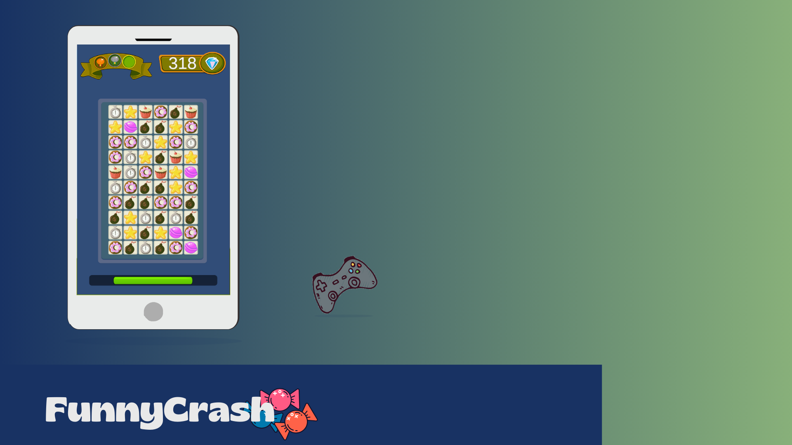
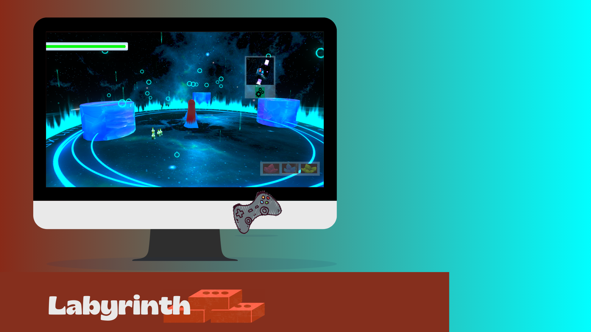
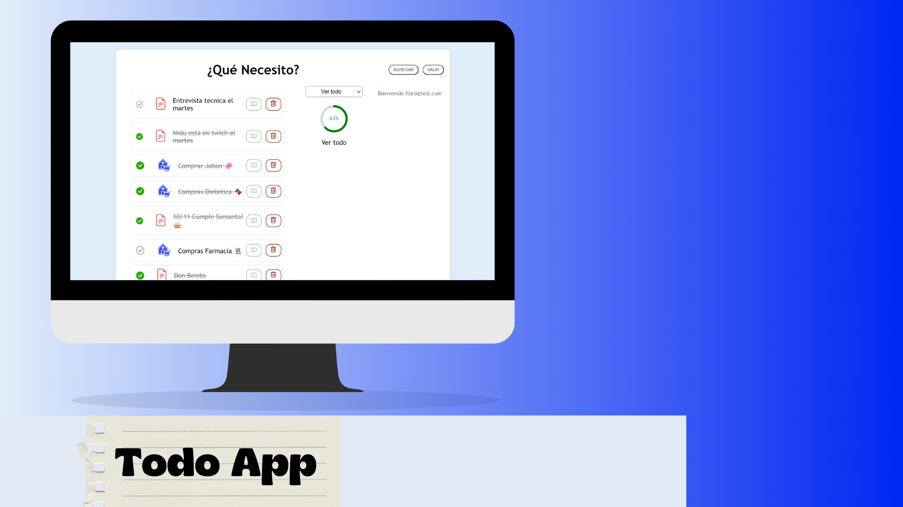
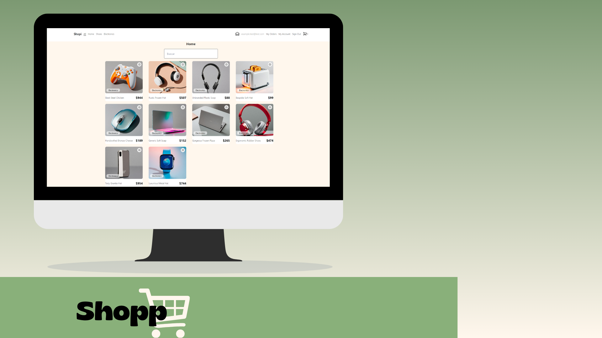
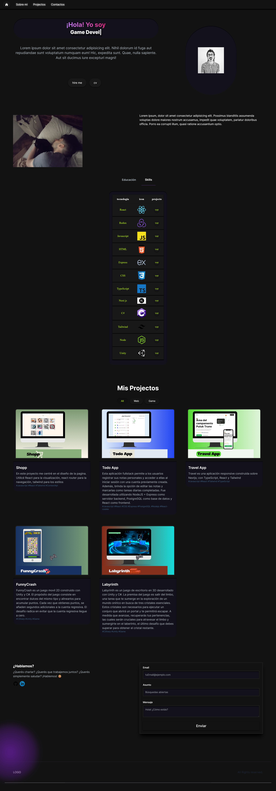

# 📒 Portfolio

## Descripción
En este porfolio encontrarás algunos proyectos en los que estuve trabajando en el ultimo tiempo.

<hr/>


| Proyectos         |                          |                          |                          |                          |
|-------------------|--------------------------|--------------------------|--------------------------|--------------------------|
| Funny Crash       | Labyrinth                | Todo App                 | Shopi App                | Travel App               |
|  |  |  |  |  |


<hr/>


## Requisitos Previos 
Antes de comenzar, asegúrate de tener instalado lo siguiente:
- [Node.js](https://nodejs.org/): Para ejecutar la aplicación.
- Navegador web moderno.

## Instalación
Sigue estos pasos para instalar y ejecutar el **portfolio**:

1. Clona el repositorio:
   ```bash
   git clone git@github.com:nahwish/theportfolio.git
2. Navega al directorio del proyecto:
   ```bash
   cd theportfolio
3. Instala las dependencias generales:
   ```bash
   npm install
4. Ejecutá la aplicación:
   ```bash
   npm run dev




Contacto
Si tienes preguntas o comentarios, no dudes en ponerte en contacto con Nehuel en [nahudaro@gmail.com].
